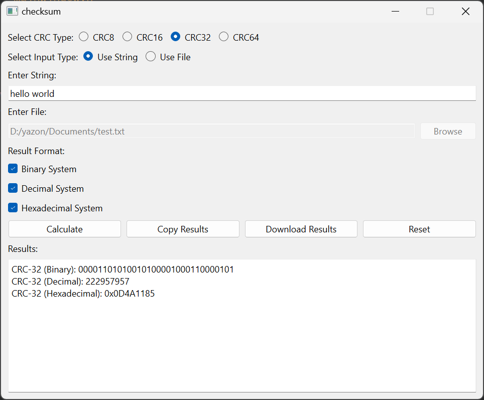

# CRC and Checksum Calculator

This project is a Qt-based C++ application for calculating various types of CRC (Cyclic Redundancy Check) algorithms. It supports CRC-8, CRC-16, CRC-32, and CRC-64. The application can compute CRC values for both string and file inputs, and it allows the results to be displayed in binary, decimal, or hexadecimal formats. You can also save the results to a file or copy them to the clipboard.

## Features
- **CRC Algorithms**: Choose between CRC-8, CRC-16, CRC-32, and CRC-64.
- **Input Types**: Calculate CRC for a string or a file.
- **Result Formats**: View results in Binary, Decimal, and Hexadecimal systems.
- **Save Results**: Save CRC results to a file.
- **Copy to Clipboard**: Copy the results to the clipboard for easy sharing.
- **Reset Form**: Reset the form to default settings.

## Screenshots
[](media/checksum.mp4)

## Note 
A video have been uploaded to demonstrate how the app works and explain its features. If the video do not play directly in this document(README.md), you can find it in the media folder for offline viewing.

## Requirements
- **Qt Framework**: Install the Qt libraries to build and run the application.
- **C++ Compiler**: Make sure you have a C++11 compliant compiler.
- **CMake** (optional): If you prefer to use CMake for building the project.

## Installation

1. Clone the repository:
   ```bash
   git clone <your-repository-url>
   ```

2. Open the project in Qt Creator or any other IDE that supports Qt projects.

3. Build the project.

## How to Use

1. Launch the application.
2. **Select CRC Type**: Choose one of the CRC types (CRC-8, CRC-16, CRC-32, CRC-64) using the radio buttons.
3. **Select Input Type**: Choose to calculate for a string or a file.
    - For string input, enter the string in the provided field.
    - For file input, browse and select a file.
4. **Choose Result Format**: Select one or more result formats (Binary, Decimal, Hexadecimal).
5. Click on **Calculate** to compute the CRC value.
6. **View Results**: The results will be displayed in the selected formats.
7. **Copy Results**: Use the **Copy Results** button to copy the output to the clipboard.
8. **Download Results**: Save the results to a txt file using the **Download Results** button.
9. **Reset**: Use the **Reset** button to clear all inputs and restore default settings.

## Building with CMake (Optional)

To build the project using CMake, follow these steps:

1. Create a build directory:
   ```bash
   mkdir build && cd build
   ```

2. Run CMake:
   ```bash
   cmake ..
   ```

3. Build the project:
   ```bash
   make
   ```

## Known Issues

- Make sure to select at least one result format before calculating, or no result will be shown.
- Error handling for invalid file input needs improvement.

## Future Improvements

- Add more error handling (e.g., for unsupported file types).
- Allow customization of CRC polynomials.
- Add more algorithms like MD5 or SHA.
- Improve the UI layout for better user experience.

## License

MIT License
Copyright (c) [2024] [Yazan Aladib]
